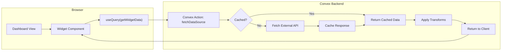
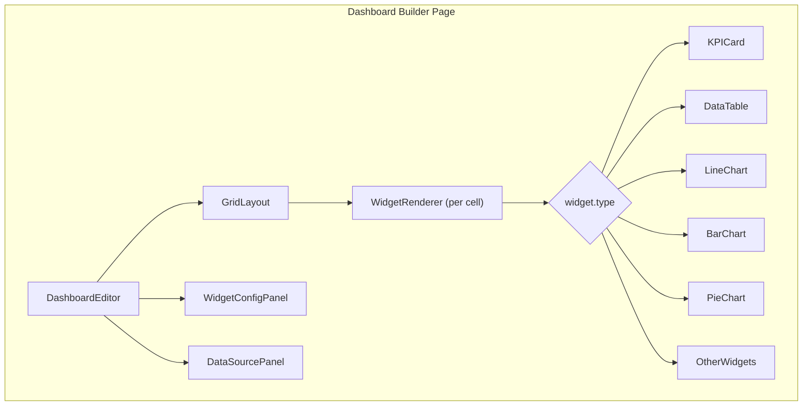

# AnyBoard — Dashboard Builder Implementation Plan

## Tech Stack

- **Framework**: Next.js 16 (App Router) + TypeScript (already set up)
- **Backend/DB**: Convex (already set up)
- **Auth**: Clerk (new) with Convex integration
- **UI**: shadcn/ui + Tailwind CSS 4 (already set up)
- **Charts**: Recharts (best React-native charting lib, highly customizable, works with dark themes)
- **Data Tables**: TanStack Table v8 + shadcn Data Table pattern
- **Dashboard Layout**: react-grid-layout (drag-and-drop grid)
- **Forms**: TanStack Form (`@tanstack/react-form`) + Zod (`zod`, `@tanstack/zod-form-adapter`)
- **Fetching**: Convex built-in hooks (`useQuery`, `useMutation`, `useAction`) — real-time reactive, no extra fetching library needed
- **New dependencies**: `@clerk/nextjs`, `@clerk/clerk-react`, `recharts`, `@tanstack/react-table`, `@tanstack/react-form`, `@tanstack/zod-form-adapter`, `zod`, `react-grid-layout`, `@types/react-grid-layout`

---

## Database Schema (Convex)

### Tables

`**users**` (synced from Clerk via webhook)

- `clerkId: string` — Clerk user ID
- `email: string`
- `name: string`
- `imageUrl?: string`

`**projects**`

- `userId: Id<"users">` — owner
- `name: string`
- `description?: string`
- `color?: string` — accent color for visual distinction in the sidebar
- `createdAt: number`
- `updatedAt: number`

`**dashboards**`

- `projectId: Id<"projects">` — parent project
- `title: string`
- `description?: string`
- `isPublic: boolean` — enables public sharing
- `publicSlug?: string` — unique slug for public URL (e.g., `/d/abc123`)
- `layout: object[]` — react-grid-layout positions `[{ i, x, y, w, h }]`
- `refreshInterval?: number` — auto-refresh in seconds (0 = manual only)
- `globalFilters?: object[]` — dashboard-level filters
- `createdAt: number`
- `updatedAt: number`

`**dataSources**`

- `userId: Id<"users">`
- `dashboardId: Id<"dashboards">`
- `name: string`
- `config: object`:
  - `url: string`
  - `method: "GET" | "POST"`
  - `headers?: Record<string, string>`
  - `authType?: "none" | "apiKey" | "bearer" | "basic"`
  - `authConfig?: object` (encrypted/stored securely)
  - `queryParams?: Record<string, string>`
  - `body?: string` (for POST)
  - `responseDataPath?: string` — JSONPath to data array (e.g., `data.results`)
- `schema: object[]` — detected/confirmed fields `[{ name, type, path }]`
- `cacheTtl?: number` — seconds to cache response
- `lastFetchedAt?: number`

`**widgets**`

- `dashboardId: Id<"dashboards">`
- `dataSourceId: Id<"dataSources">`
- `type: string` — `"kpi" | "table" | "lineChart" | "barChart" | "pieChart" | "donutChart" | "areaChart" | "scatterPlot" | "gauge" | "text" | "progressBar"`
- `title: string`
- `config: object` — type-specific configuration (see Widget Configs below)
- `transforms?: object[]` — per-widget data transformations
- `conditionalFormatting?: object[]`

### Widget Config Shapes

```typescript
// KPI Card
{ field: string, aggregation: "sum"|"avg"|"count"|"min"|"max"|"last", prefix?: string, suffix?: string, comparisonField?: string, comparisonMode?: "absolute"|"percentage" }

// Table
{ columns: [{ field, label, width?, sortable?, filterable?, editable?, format? }], pageSize: number, searchable: boolean, exportable: boolean }

// Line/Area/Bar Chart
{ xAxis: string, yAxis: string[], groupBy?: string, stacked?: boolean, curved?: boolean }

// Pie/Donut Chart
{ labelField: string, valueField: string, showLegend: boolean }

// Gauge
{ field: string, min: number, max: number, thresholds: [{ value, color }] }

// Text
{ content: string } // supports {{field}} interpolation

// Progress Bar
{ field: string, maxField?: string, max?: number, label?: string }
```

---

## Route Structure

```
app/
  (auth)/
    sign-in/[[...sign-in]]/page.tsx       # Clerk sign-in
    sign-up/[[...sign-up]]/page.tsx       # Clerk sign-up
  (app)/
    layout.tsx                             # Authenticated layout with sidebar
    projects/
      page.tsx                             # Project list (home after sign-in)
      new/page.tsx                         # Create new project
      [projectId]/
        page.tsx                           # Project overview (list of dashboards)
        settings/page.tsx                  # Project settings (name, color, delete)
        dashboards/
          new/page.tsx                     # Create new dashboard wizard
          [dashboardId]/
            page.tsx                       # Dashboard view (live)
            edit/page.tsx                  # Dashboard editor (drag-and-drop builder)
            settings/page.tsx              # Dashboard settings (title, sharing, refresh)
  d/
    [slug]/page.tsx                        # Public shared dashboard (no auth required)
  api/
    webhooks/clerk/route.ts                # Clerk webhook to sync users
  page.tsx                                 # Landing page (existing)
  showcase/                                # Keep existing design showcase
```

---

## Core Architecture

### Data Flow




### Component Architecture




---

## Phase-by-Phase Breakdown

### Phase 1: Auth + Project Structure

- Install and configure `@clerk/nextjs` with Convex
- Set up Clerk middleware for protected routes (`[middleware.ts](middleware.ts)`)
- Create `(auth)` routes for sign-in/sign-up
- Create `(app)` layout with sidebar navigation
- Create Clerk webhook handler to sync users to Convex `users` table
- Define all Convex schema tables

### Phase 2: Data Source Configuration

- **Data Source Wizard** (multi-step form):
  1. Enter REST endpoint URL + method
  2. Configure headers and authentication (API key / Bearer / Basic)
  3. Add query parameters (key-value pairs)
  4. "Test Connection" button — Convex action hits the endpoint, returns sample response
  5. Auto-detect schema from response — show field names, inferred types, sample values
  6. User confirms/edits schema (rename fields, change types, set `responseDataPath` for nested data)
  7. Save data source
- **Convex action: `fetchExternalApi**`
  - Accepts data source config
  - Makes the HTTP request server-side (no CORS issues)
  - Caches response in Convex with TTL
  - Returns parsed data + detected schema

### Phase 3: Widget System

- Create a `WidgetRenderer` component that switches on `widget.type`
- Implement each widget type as a standalone component:
**KPI Card** — shows a single aggregated number, optional trend indicator, uses your existing `Card` component
**Data Table** (TanStack Table + shadcn) — advanced features:
  - Column sorting (single + multi)
  - Column filtering (text, number range, date range, select)
  - Global search across all columns
  - Pagination with configurable page size
  - Column visibility toggle (dropdown to show/hide columns)
  - Column resizing (drag column borders)
  - Row selection (checkbox column)
  - Inline editing (double-click cell to edit, for editable columns)
  - CSV export button (download filtered data)
  - Responsive: horizontal scroll on small screens
  **Charts** (Recharts):
  - Line Chart, Area Chart, Bar Chart, Pie/Donut Chart, Scatter Plot
  - All charts respect the dark theme (dark background, amber accent, white text)
  - Tooltip on hover, optional legend
  - Responsive container
  **Gauge** — SVG-based semicircle gauge with color thresholds
  **Text** — Markdown renderer with `{{field}}` variable interpolation from data
  **Progress Bar** — uses existing shadcn `Progress` with data binding

### Phase 4: Dashboard Builder (Drag-and-Drop)

- Install `react-grid-layout`
- **Dashboard Editor page**:
  - Left sidebar: list of data sources + "Add Widget" toolbox
  - Center: responsive grid canvas with drag-and-drop + resize
  - Right sidebar: widget configuration panel (appears when a widget is selected)
  - Top bar: dashboard title (editable), save button, preview button, settings
- **Add Widget flow**:
  1. Pick a data source (or create new one)
  2. Pick widget type
  3. Configure fields (x-axis, y-axis, etc.)
  4. Widget appears on grid, drag to position and resize
- **Grid config**: 12-column grid, auto-height rows, draggable + resizable
- **Auto-save** — debounced save to Convex on every layout change

### Phase 5: Dashboard View (Live)

- Read-only rendering of the dashboard
- Each widget fetches its data independently via Convex queries
- Auto-refresh based on `dashboard.refreshInterval`
- Manual refresh button
- Global filters (date range, dropdown filters) — filter data across all widgets
- Full-screen mode
- "Last updated" timestamp per widget

### Phase 6: Sharing

- Dashboard settings page:
  - Toggle `isPublic`
  - Auto-generate `publicSlug` (short alphanumeric)
  - Copy link button for `/d/{slug}`
- Public route `/d/[slug]`:
  - No auth required
  - Read-only dashboard view
  - "Built with AnyBoard" watermark/badge (optional)
  - Embed mode: add `?embed=true` query param, hides header/footer for iframe embedding

---

## Key Files to Create/Modify

### New Files (approximate count: ~40)

**Convex**:

- `convex/schema.ts` — full database schema
- `convex/users.ts` — user queries/mutations
- `convex/projects.ts` — CRUD for projects
- `convex/dashboards.ts` — CRUD for dashboards
- `convex/dataSources.ts` — CRUD + fetch external API action
- `convex/widgets.ts` — CRUD for widgets
- `convex/http.ts` — Clerk webhook endpoint

**App Routes**:

- `middleware.ts` — Clerk auth middleware
- `app/(auth)/sign-in/[[...sign-in]]/page.tsx`
- `app/(auth)/sign-up/[[...sign-up]]/page.tsx`
- `app/(app)/layout.tsx` — authenticated shell (sidebar + header)
- `app/(app)/projects/page.tsx` — project list (home)
- `app/(app)/projects/new/page.tsx` — create project
- `app/(app)/projects/[projectId]/page.tsx` — project overview (dashboard list)
- `app/(app)/projects/[projectId]/settings/page.tsx` — project settings
- `app/(app)/projects/[projectId]/dashboards/new/page.tsx` — create dashboard wizard
- `app/(app)/projects/[projectId]/dashboards/[dashboardId]/page.tsx` — live view
- `app/(app)/projects/[projectId]/dashboards/[dashboardId]/edit/page.tsx` — builder
- `app/(app)/projects/[projectId]/dashboards/[dashboardId]/settings/page.tsx`
- `app/d/[slug]/page.tsx` — public view
- `app/api/webhooks/clerk/route.ts`

**Components**:

- `components/dashboard/grid-layout.tsx` — drag-and-drop grid wrapper
- `components/dashboard/widget-renderer.tsx` — routes widget type to component
- `components/dashboard/widget-config-panel.tsx` — right sidebar config
- `components/widgets/kpi-card.tsx`
- `components/widgets/data-table.tsx` — TanStack + shadcn advanced table
- `components/widgets/line-chart.tsx`
- `components/widgets/bar-chart.tsx`
- `components/widgets/pie-chart.tsx`
- `components/widgets/area-chart.tsx`
- `components/widgets/scatter-plot.tsx`
- `components/widgets/gauge.tsx`
- `components/widgets/text-widget.tsx`
- `components/widgets/progress-widget.tsx`
- `components/data-source/source-wizard.tsx` — multi-step data source config
- `components/data-source/schema-editor.tsx` — edit detected schema
- `components/data-source/transform-builder.tsx` — filter/sort/aggregate UI
- `components/layout/app-sidebar.tsx`
- `components/layout/app-header.tsx`

**Utilities**:

- `lib/transforms.ts` — data transformation pipeline (filter, sort, aggregate, compute)
- `lib/schema-detector.ts` — auto-detect types from JSON response
- `lib/export.ts` — CSV export utility

### Modified Files

- `[package.json](package.json)` — new dependencies
- `[convex/schema.ts](convex/schema.ts)` — if it exists, extend it
- `[app/layout.tsx](app/layout.tsx)` — wrap with ClerkProvider + ConvexProviderWithClerk

---

## Build Guidelines

- **Follow the `next-best-practices` skill** (`c:\Users\prate\.cursor\skills\next-best-practices\SKILL.md`) throughout all implementation. Key areas to enforce:
  - RSC boundaries — keep components server by default, only add `'use client'` where needed (hooks, interactivity)
  - Async APIs — `params`, `searchParams`, `cookies()`, `headers()` are all async in Next.js 15+
  - Data patterns — avoid waterfalls, use `Promise.all` and Suspense for parallel data loading
  - Error handling — add `error.tsx`, `not-found.tsx` at route segment boundaries
  - Metadata — use `generateMetadata` for dynamic pages (dashboard titles, project names)
  - File conventions — follow Next.js 16 conventions (route groups, dynamic segments, loading states)
  - Route handlers — use for the Clerk webhook (`app/api/webhooks/clerk/route.ts`)
  - Hydration — avoid browser-only APIs in server components, be careful with dates/timestamps

---

## Design Notes

- Keep the existing dark theme (`#0d0d0d` background, amber `#fbbf24` accents, JetBrains Mono)
- Charts should use amber as primary color, with a palette derived from amber for multi-series
- The dashboard builder should feel like a modern tool (think Notion meets Grafana)
- All widgets render inside `Card` components from shadcn for visual consistency
- Use the existing showcase design system — the "Soft & Rounded" (showcase/3) style fits best for a dashboard app

