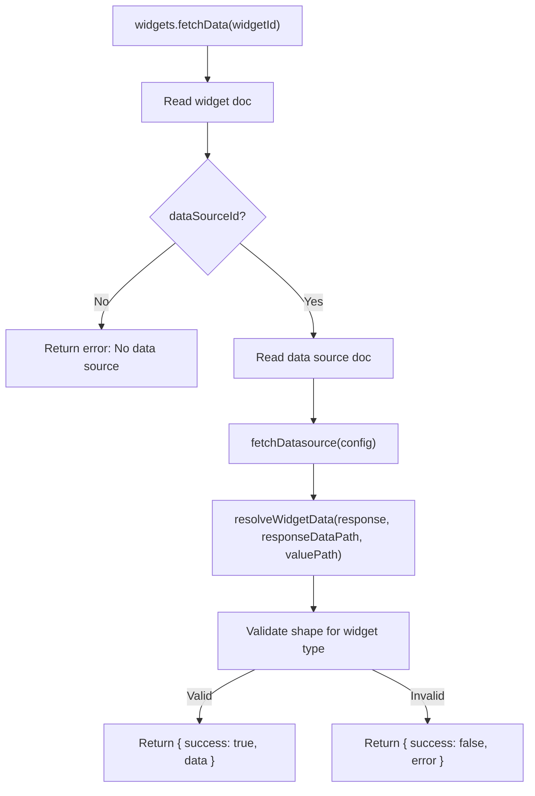

# Phase 3 — Widget System

Build widget CRUD, data resolution, structured config forms, and widget renderers so users can add widgets to dashboards and see live data.

## User Review Required

> [!IMPORTANT]
> **Charting library choice** — No charting library is installed yet. This plan assumes **Recharts** (`recharts`) since it's React-native, has strong TypeScript support, and works well with SSR/Next.js. If you prefer a different library (e.g. Nivo, Chart.js) let me know before execution.

> [!WARNING]
> **Schema migration: removing `responseType`** — The existing `dataSources` table and validators reference `responseType`. This plan removes it from the schema, Convex validators, zod schemas, constants, wizard, and edit form. Existing documents in Convex that already have the `responseType` field will retain it as leftover data (Convex is schema-flexible), but it will no longer be read or written. If you want a data backfill/cleanup step instead, let me know.

> [!IMPORTANT]
> **Dashboard detail page** — Currently `dashboards/[dashboardId]` has no `page.tsx`. This plan creates it as the widget canvas. The existing empty directories at `dashboards/[dashboardId]/data-sources/` are unused placeholder routes from earlier scaffolding — this plan does **not** touch them.

---

## Proposed Changes

### 1. Schema & Convex Backend

#### [MODIFY] [schema.ts](file:///c:/Users/prate/PRATEEK/Web%20Dev%20Projects/anyboard/convex/schema.ts)

**Remove `responseType` from `dataSources.config`:**

```diff
 config: v.object({
   url: v.string(),
   method: v.union(v.literal("GET"), v.literal("POST")),
-  responseType: v.union(v.literal("array"), v.literal("object")),
   headers: v.optional(v.any()),
   ...
 }),
```

**Replace `widgets` table — SCREAM_CASE types, add `valuePath` + `updatedAt`, remove `transforms`/`conditionalFormatting`:**

```ts
widgets: defineTable({
  projectId: v.id("projects"),
  dashboardId: v.id("dashboards"),
  dataSourceId: v.optional(v.id("dataSources")),
  type: v.union(
    v.literal("KPI"),
    v.literal("TABLE"),
    v.literal("LINE_CHART"),
    v.literal("BAR_CHART"),
    v.literal("PIE_CHART"),
    v.literal("DONUT_CHART"),
    v.literal("AREA_CHART"),
    v.literal("SCATTER_PLOT"),
    v.literal("GAUGE"),
    v.literal("PROGRESS_BAR")
  ),
  title: v.string(),
  config: v.any(),              // keep v.any() in Convex — real validation lives in zod
  valuePath: v.optional(v.string()),  // widget-level value path
  updatedAt: v.number(),
})
```

> [!NOTE]
> **No `TEXT` type** — KPI already handles single-value display (string, number, boolean). A separate Text widget would be redundant. KPI with no prefix/suffix is functionally identical.

Key decisions:
- **`config` stays `v.any()`** in Convex — discriminated unions aren't supported. Real validation is in zod.
- **`valuePath`** is top-level (not nested inside config) for consistency with datasource `responseDataPath`.
- **`transforms` and `conditionalFormatting` removed** — unused `v.any()` placeholders. Re-add when implemented.

---

#### [MODIFY] [dataSources.ts](file:///c:/Users/prate/PRATEEK/Web%20Dev%20Projects/anyboard/convex/dataSources.ts)

- Remove `responseType` from `dataSourceConfigValidator`.
- Refactor `testConnection` to call the new shared `fetchDatasource` helper (see below).

---

#### [NEW] [_lib/fetch-datasource.ts](file:///c:/Users/prate/PRATEEK/Web%20Dev%20Projects/anyboard/convex/_lib/fetch-datasource.ts)

Extract duplicated fetch logic from `dataSources.ts` into a shared internal helper:

```ts
export async function fetchDatasource(config: DataSourceConfig): Promise<FetchResult> {
  // build headers, auth, query params, body → fetch → return { success, status, data, error }
}
```

Both `dataSources.testConnection` and `widgets.fetchData` will call this.

---

#### [NEW] [widgets.ts](file:///c:/Users/prate/PRATEEK/Web%20Dev%20Projects/anyboard/convex/widgets.ts)

Full widget CRUD + data fetch action:

**Queries:**
- `listByDashboard({ dashboardId })` — returns all widgets for a dashboard, auth-checked via project ownership
- `get({ id })` — single widget by ID, auth-checked

**Mutations:**
- `create({ dashboardId, type, title, dataSourceId?, config, valuePath? })` — inserts with `updatedAt: Date.now()`, derives `projectId` from dashboard
- `update({ id, title?, dataSourceId?, config?, valuePath? })` — patches with `updatedAt: Date.now()`, validates ownership
- `remove({ id })` — deletes after ownership check

**Action:**
- `fetchData({ widgetId })` — the full resolution pipeline:
  1. Read widget doc → get `dataSourceId` and `valuePath`
  2. If no `dataSourceId`, return `{ success: false, error: "No data source configured" }`
  3. Read data source doc → call `fetchDatasource(config)`
  4. Call `resolveWidgetData(response, responseDataPath, valuePath)` (centralized function — see below)
  5. **Validate** resolved payload shape for the widget type:
     - `KPI` / `GAUGE` / `PROGRESS_BAR`: must be a single primitive (string, number, boolean)
     - `TABLE` / `LINE_CHART` / `BAR_CHART` / `PIE_CHART` / `DONUT_CHART` / `AREA_CHART` / `SCATTER_PLOT`: must be an array of objects
  6. Return `{ success: true, data }` or `{ success: false, error: "Expected <shape> but got <actual>" }`

---

### 2. Centralized Data Resolution

#### [MODIFY] [data-utils.ts](file:///c:/Users/prate/PRATEEK/Web%20Dev%20Projects/anyboard/lib/data-utils.ts)

Add a centralized `resolveWidgetData` function alongside the existing `extractDataAtPath`:

```ts
/** Apply datasource responseDataPath then widget valuePath in sequence. */
export function resolveWidgetData(
  response: unknown,
  responseDataPath?: string,
  valuePath?: string
): unknown {
  let data = extractDataAtPath(response, responseDataPath);
  data = extractDataAtPath(data, valuePath);
  return data;
}
```

This is used by both:
- `convex/widgets.ts` → `fetchData` action (server-side resolution)
- Any client-side preview if needed in the future

---

### 3. Client-Side Schemas & Constants

#### [MODIFY] [schemas.ts](file:///c:/Users/prate/PRATEEK/Web%20Dev%20Projects/anyboard/lib/schemas.ts)

**Remove `responseType` from `dataSourceConfigSchema`.**

**Add widget type const object and config schemas:**

```ts
// --- Widget type enum (SCREAM_CASE const object) ---
export const WIDGET_TYPE = {
  KPI: "KPI",
  GAUGE: "GAUGE",
  PROGRESS_BAR: "PROGRESS_BAR",
  TABLE: "TABLE",
  LINE_CHART: "LINE_CHART",
  BAR_CHART: "BAR_CHART",
  AREA_CHART: "AREA_CHART",
  PIE_CHART: "PIE_CHART",
  DONUT_CHART: "DONUT_CHART",
  SCATTER_PLOT: "SCATTER_PLOT",
} as const;
export type WidgetType = (typeof WIDGET_TYPE)[keyof typeof WIDGET_TYPE];

// --- Per-type config schemas ---
export const kpiConfigSchema = z.object({
  prefix: z.string().max(20).optional(),
  suffix: z.string().max(20).optional(),
});
export type KpiConfig = z.infer<typeof kpiConfigSchema>;

export const gaugeConfigSchema = z.object({
  min: z.number().default(0),
  max: z.number().default(100),
  unit: z.string().max(10).optional(),
});
export type GaugeConfig = z.infer<typeof gaugeConfigSchema>;

export const progressBarConfigSchema = z.object({
  max: z.number().positive().default(100),
  maxField: z.string().optional(),
  label: z.string().max(50).optional(),
});
export type ProgressBarConfig = z.infer<typeof progressBarConfigSchema>;

export const tableConfigSchema = z.object({
  columns: z.array(z.object({
    field: z.string().min(1),
    label: z.string().optional(),
  })).default([]),                          // empty = auto-detect from first record
  pageSize: z.number().int().positive().default(10),
});
export type TableConfig = z.infer<typeof tableConfigSchema>;

export const chartConfigSchema = z.object({
  xField: z.string().min(1, "X axis field is required"),
  yFields: z.array(z.string().min(1)).min(1, "At least one Y axis field is required"),
  colors: z.array(z.string()).optional(),
});
export type ChartConfig = z.infer<typeof chartConfigSchema>;

export const pieConfigSchema = z.object({
  nameField: z.string().min(1, "Name field is required"),
  valueField: z.string().min(1, "Value field is required"),
  colors: z.array(z.string()).optional(),
});
export type PieConfig = z.infer<typeof pieConfigSchema>;

export const scatterConfigSchema = z.object({
  xField: z.string().min(1, "X field is required"),
  yField: z.string().min(1, "Y field is required"),
  sizeField: z.string().optional(),
});
export type ScatterConfig = z.infer<typeof scatterConfigSchema>;

// --- Widget form schema ---
export const widgetBaseSchema = z.object({
  title: z.string().min(1, "Title is required").max(100),
  dataSourceId: z.string().optional(),
  valuePath: z.string().optional(),
  type: z.enum([
    WIDGET_TYPE.KPI, WIDGET_TYPE.GAUGE, WIDGET_TYPE.PROGRESS_BAR,
    WIDGET_TYPE.TABLE, WIDGET_TYPE.LINE_CHART, WIDGET_TYPE.BAR_CHART,
    WIDGET_TYPE.AREA_CHART, WIDGET_TYPE.PIE_CHART, WIDGET_TYPE.DONUT_CHART,
    WIDGET_TYPE.SCATTER_PLOT,
  ]),
});

// Config schemas keyed by type for runtime lookup
export const WIDGET_CONFIG_SCHEMAS: Record<WidgetType, z.ZodTypeAny> = {
  KPI: kpiConfigSchema,
  GAUGE: gaugeConfigSchema,
  PROGRESS_BAR: progressBarConfigSchema,
  TABLE: tableConfigSchema,
  LINE_CHART: chartConfigSchema,
  BAR_CHART: chartConfigSchema,
  AREA_CHART: chartConfigSchema,
  PIE_CHART: pieConfigSchema,
  DONUT_CHART: pieConfigSchema,
  SCATTER_PLOT: scatterConfigSchema,
};
```

---

#### [MODIFY] [constants.ts](file:///c:/Users/prate/PRATEEK/Web%20Dev%20Projects/anyboard/lib/constants.ts)

- Remove `RESPONSE_TYPE_OPTIONS`
- Add `WIDGET_TYPE_OPTIONS` referencing `WIDGET_TYPE` values:

```ts
export const WIDGET_TYPE_OPTIONS = [
  { value: "KPI", label: "KPI", description: "Single value metric" },
  { value: "GAUGE", label: "Gauge", description: "Numeric gauge dial" },
  { value: "PROGRESS_BAR", label: "Progress", description: "Progress bar" },
  { value: "TABLE", label: "Table", description: "Data table" },
  { value: "LINE_CHART", label: "Line Chart", description: "Line chart" },
  { value: "BAR_CHART", label: "Bar Chart", description: "Bar chart" },
  { value: "AREA_CHART", label: "Area Chart", description: "Area chart" },
  { value: "PIE_CHART", label: "Pie Chart", description: "Pie chart" },
  { value: "DONUT_CHART", label: "Donut Chart", description: "Donut chart" },
  { value: "SCATTER_PLOT", label: "Scatter", description: "Scatter plot" },
] as const;
```

---

### 4. Remove `responseType` from Data Source UI

#### [MODIFY] [data-source-wizard.tsx](file:///c:/Users/prate/PRATEEK/Web%20Dev%20Projects/anyboard/components/data-source/data-source-wizard.tsx)

- Remove the "Response type" `<Select>` field (currently in step 1)
- Remove `responseType` from `DEFAULT_VALUES`
- Remove `watchedResponseType` and its usage in `isCurrentStepValid`
- Remove `responseType` from the step 4 review summary
- Remove `responseType` from the `config` object built in `onSubmit` and `runTestConnection`

#### [MODIFY] [data-source-edit-form.tsx](file:///c:/Users/prate/PRATEEK/Web%20Dev%20Projects/anyboard/components/data-source/data-source-edit-form.tsx)

- Remove the "Response type" `<Select>` field
- Remove `responseType` from `defaultValues()` function
- Remove `responseType` from the `config` object built in `onSubmit` and `runTestConnection`

---

### 5. Widget UI Components

#### [NEW] [components/widgets/widget-error.tsx](file:///c:/Users/prate/PRATEEK/Web%20Dev%20Projects/anyboard/components/widgets/widget-error.tsx)

Shared error display inside widget cards. Props: `{ error: string }`.

---

#### [NEW] [components/widgets/create-widget-dialog.tsx](file:///c:/Users/prate/PRATEEK/Web%20Dev%20Projects/anyboard/components/widgets/create-widget-dialog.tsx)

Dialog for creating/editing a widget. Follows the `CreateDashboardDialog` pattern:
- Props: `dashboardId`, `projectId`, `open`, `onOpenChange`, `widget?` (for edit mode)
- Uses `useForm` with `zodResolver`
- **Step 1**: Type picker — grid of cards for each widget type (using `WIDGET_TYPE_OPTIONS`)
- **Step 2**: General settings — title, data source picker (Select dropdown populated from `useQuery(api.dataSources.list, { projectId })`), optional `valuePath` input
- **Step 3**: Type-specific config (rendered by `WidgetConfigFields`)
- Form submission calls `api.widgets.create` or `api.widgets.update`

The dialog uses a **simple 3-step internal state**. "Back" and "Next" buttons navigate steps, final step has "Create" / "Save".

---

#### [NEW] [components/widgets/widget-config-fields.tsx](file:///c:/Users/prate/PRATEEK/Web%20Dev%20Projects/anyboard/components/widgets/widget-config-fields.tsx)

Renders structured form fields for each widget type's config. Takes `type: WidgetType` and `form: UseFormReturn` as props. Uses a `switch` on `type`:

| Widget Type | Config Fields |
|---|---|
| `KPI` | Prefix (Input), Suffix (Input) |
| `GAUGE` | Min (Input number), Max (Input number), Unit (Input) |
| `PROGRESS_BAR` | Max (Input number), Max Field (Input), Label (Input) |
| `TABLE` | Columns (repeater: field + label), Page Size (Input number) |
| `LINE_CHART` / `BAR_CHART` / `AREA_CHART` | X Field (Input), Y Fields (repeater of Inputs) |
| `PIE_CHART` / `DONUT_CHART` | Name Field (Input), Value Field (Input) |
| `SCATTER_PLOT` | X Field (Input), Y Field (Input), Size Field? (Input) |

All fields use `Controller` + `Field` + `FieldLabel` + `FieldError` consistently.

---

#### [NEW] [components/widgets/widget-renderer.tsx](file:///c:/Users/prate/PRATEEK/Web%20Dev%20Projects/anyboard/components/widgets/widget-renderer.tsx)

Master renderer component. Props: `widget: Doc<"widgets">`. Internally:
1. Calls `useAction(api.widgets.fetchData)` on mount
2. Shows loading skeleton while fetching
3. If result is `{ success: false }`, shows `<WidgetError>`
4. If success, delegates to the type-specific renderer based on `widget.type`

---

#### [NEW] Individual widget renderers in `components/widgets/renderers/`:

| File | Component | Data shape |
|---|---|---|
| `kpi-renderer.tsx` | `KpiRenderer` | `{ value: string \| number \| boolean, config: KpiConfig }` |
| `gauge-renderer.tsx` | `GaugeRenderer` | `{ value: number, config: GaugeConfig }` |
| `progress-renderer.tsx` | `ProgressRenderer` | `{ value: number, config: ProgressBarConfig }` — uses shadcn `<Progress>` |
| `table-renderer.tsx` | `TableRenderer` | `{ data: Record[], config: TableConfig }` — uses shadcn `<Table>` |
| `chart-renderer.tsx` | `ChartRenderer` | `{ data: Record[], config: ChartConfig, type }` — handles line, bar, area |
| `pie-renderer.tsx` | `PieRenderer` | `{ data: Record[], config: PieConfig, type }` — handles pie + donut |
| `scatter-renderer.tsx` | `ScatterRenderer` | `{ data: Record[], config: ScatterConfig }` |

> [!NOTE]
> The **Progress renderer** uses the existing shadcn `<Progress>` component from `components/ui/progress.tsx` (already installed). KPI and Gauge are pure HTML/CSS. Charts use Recharts.

---

### 6. Dashboard Detail Page

#### [NEW] [page.tsx](file:///c:/Users/prate/PRATEEK/Web%20Dev%20Projects/anyboard/app/(app)/projects/[projectId]/dashboards/[dashboardId]/page.tsx)

The main dashboard view page:
- Fetches dashboard via `useQuery(api.dashboards.get, { id: dashboardId })`
- Fetches widgets via `useQuery(api.widgets.listByDashboard, { dashboardId })`
- Shows dashboard title + description header
- "Add Widget" button opens `CreateWidgetDialog`
- Renders widgets in a **CSS grid** (simple responsive grid, no drag-and-drop yet)
- Each widget is wrapped in a `Card` with its title and a kebab menu (Edit / Delete)
- Inside each card, renders `<WidgetRenderer widget={widget} />`

#### [NEW] [loading.tsx](file:///c:/Users/prate/PRATEEK/Web%20Dev%20Projects/anyboard/app/(app)/projects/[projectId]/dashboards/[dashboardId]/loading.tsx)

Skeleton loading state matching the dashboard detail layout.

---

### 7. Dependencies

#### [MODIFY] [package.json](file:///c:/Users/prate/PRATEEK/Web%20Dev%20Projects/anyboard/package.json)

```bash
pnpm add recharts
```

---

## Summary of All Files

| Action | File |
|--------|------|
| MODIFY | `convex/schema.ts` — remove `responseType`, SCREAM_CASE widget types, add `valuePath` + `updatedAt`, remove `transforms`/`conditionalFormatting` |
| MODIFY | `convex/dataSources.ts` — remove `responseType` from validator, use shared fetch helper |
| NEW | `convex/_lib/fetch-datasource.ts` — shared fetch helper |
| NEW | `convex/widgets.ts` — full CRUD + `fetchData` action using `resolveWidgetData` |
| MODIFY | `lib/data-utils.ts` — add centralized `resolveWidgetData` function |
| MODIFY | `lib/schemas.ts` — remove `responseType`, add `WIDGET_TYPE` const object + all config schemas |
| MODIFY | `lib/constants.ts` — remove `RESPONSE_TYPE_OPTIONS`, add `WIDGET_TYPE_OPTIONS` |
| MODIFY | `components/data-source/data-source-wizard.tsx` — remove `responseType` field |
| MODIFY | `components/data-source/data-source-edit-form.tsx` — remove `responseType` field |
| NEW | `components/widgets/widget-error.tsx` |
| NEW | `components/widgets/create-widget-dialog.tsx` |
| NEW | `components/widgets/widget-config-fields.tsx` |
| NEW | `components/widgets/widget-renderer.tsx` |
| NEW | `components/widgets/renderers/kpi-renderer.tsx` |
| NEW | `components/widgets/renderers/gauge-renderer.tsx` |
| NEW | `components/widgets/renderers/progress-renderer.tsx` — uses shadcn `<Progress>` |
| NEW | `components/widgets/renderers/table-renderer.tsx` |
| NEW | `components/widgets/renderers/chart-renderer.tsx` |
| NEW | `components/widgets/renderers/pie-renderer.tsx` |
| NEW | `components/widgets/renderers/scatter-renderer.tsx` |
| NEW | `app/(app)/projects/[projectId]/dashboards/[dashboardId]/page.tsx` |
| NEW | `app/(app)/projects/[projectId]/dashboards/[dashboardId]/loading.tsx` |
| MODIFY | `package.json` — add `recharts` |

---

## Data Resolution Flow



---

## Verification Plan

### Build Check

```bash
pnpm build
```

### Manual Verification

1. **Data source responseType removal**
   - Open an existing data source edit page → "Response type" field is gone
   - Create a new data source via wizard → step 1 no longer shows "Response type"
   - Save a data source → persists correctly without `responseType`

2. **Widget CRUD**
   - Navigate to a dashboard detail page
   - Click "Add Widget" → type picker shows SCREAM_CASE types
   - Select KPI → step 2 shows title + datasource picker + valuePath
   - Step 3 shows type-specific fields (prefix/suffix for KPI)
   - Create → widget appears on the dashboard
   - Edit → values are pre-populated → save
   - Delete → widget disappears

3. **Widget data resolution**
   - KPI widget with `valuePath: "title"` on `jsonplaceholder.typicode.com/todos/1` → shows todo title
   - KPI widget with no `valuePath` on the same endpoint → error (object, not primitive)
   - Table widget on `jsonplaceholder.typicode.com/users` → renders users table
   - Table widget on `jsonplaceholder.typicode.com/todos/1` → error "Expected array but got object"

4. **Widget error display**
   - Widget with no data source → "No data source configured"
   - KPI widget bound to list endpoint → shape mismatch error
   - Errors are clear and visible, not silently swallowed
